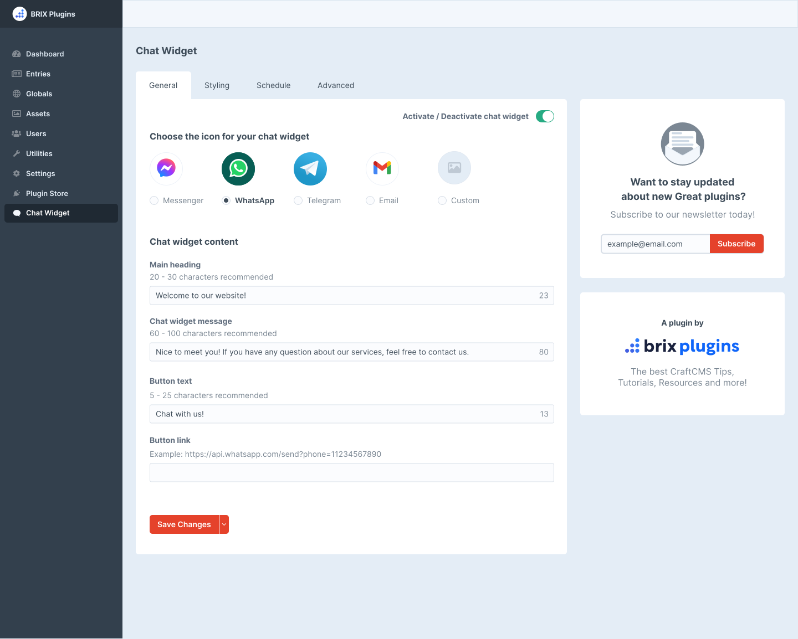

# Chat Widget plugin for Craft CMS 3.x

Install an simple and easy to customize chat widget on your website

## Requirements

This plugin requires Craft CMS 3.0.0 or later.

## Installation

To install the plugin, follow these instructions.

1. Open your terminal and go to your Craft project:

        cd /path/to/project

2. Then tell Composer to load the plugin:

        composer require brixplugins/chat-widget

3. In the Control Panel, go to Settings → Plugins and click the “Install” button for Chat Widget.

## Chat Widget Overview

[Chat Widget Docs](https://brixplugins.com/plugins/chat-widget)

## Chat Widget Roadmap

Some things to do, and ideas for potential features:

* Release it

Brought to you by [Brix Plugins](https://brixplugins.com/)
